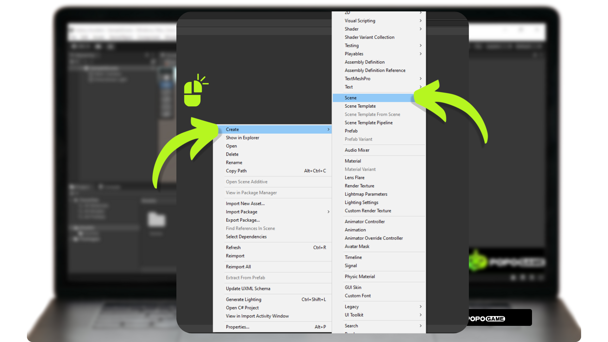
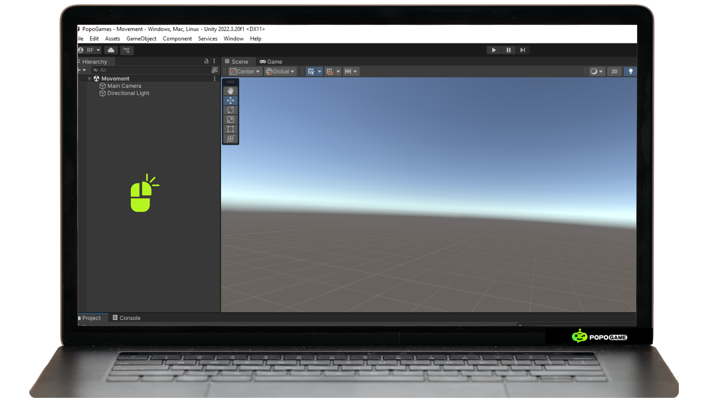
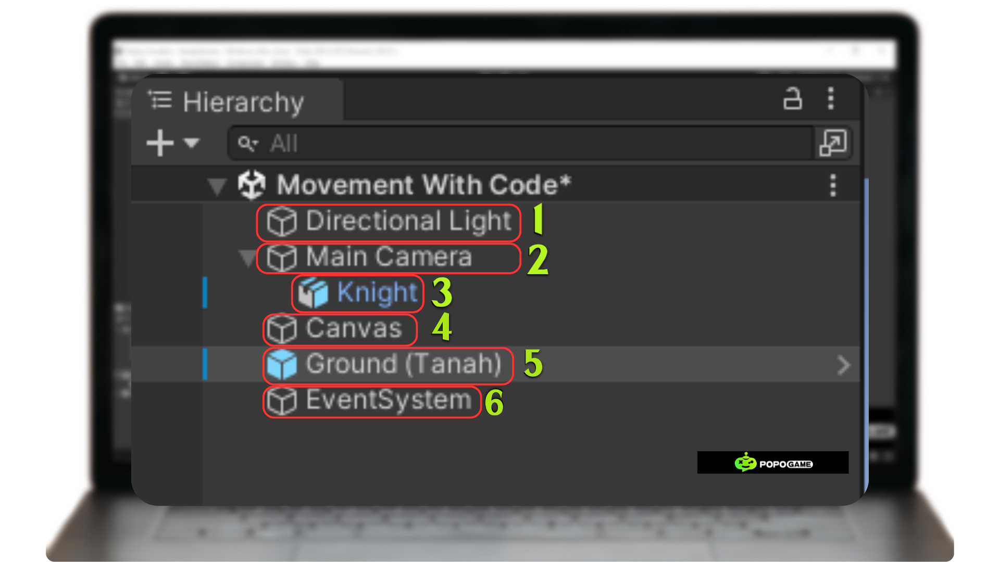
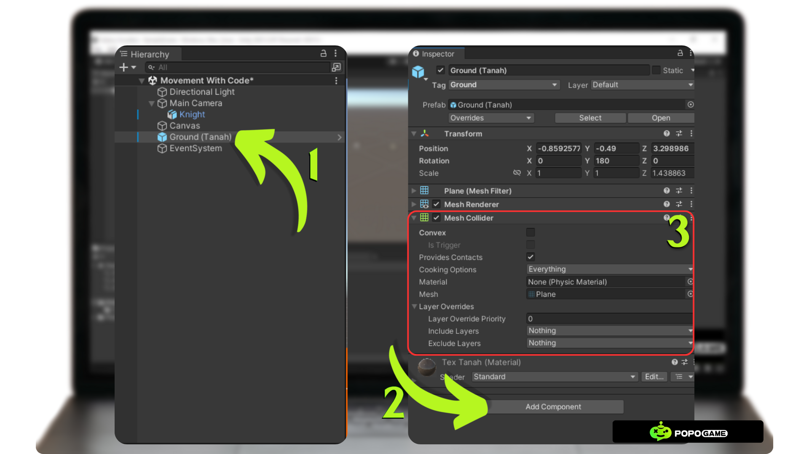
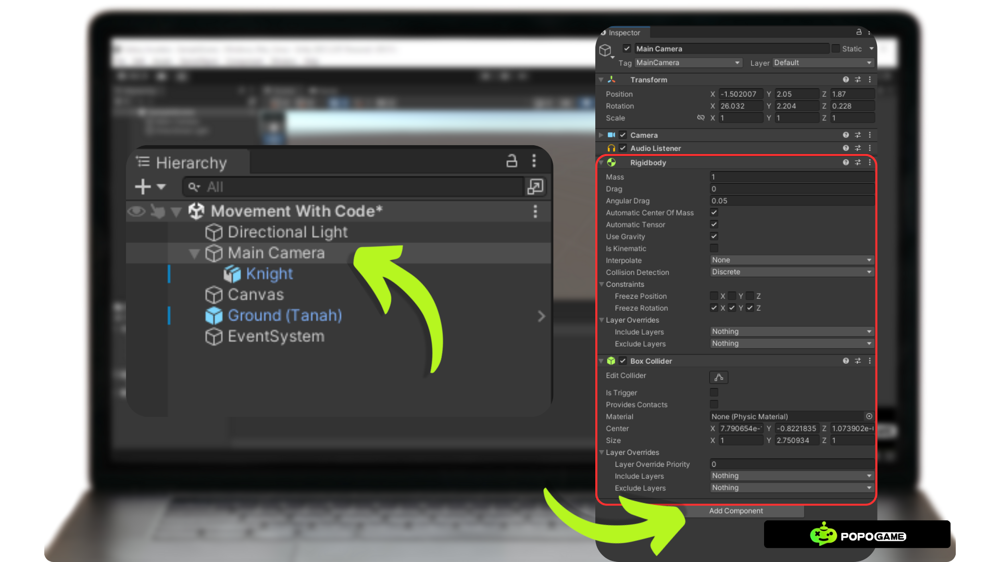
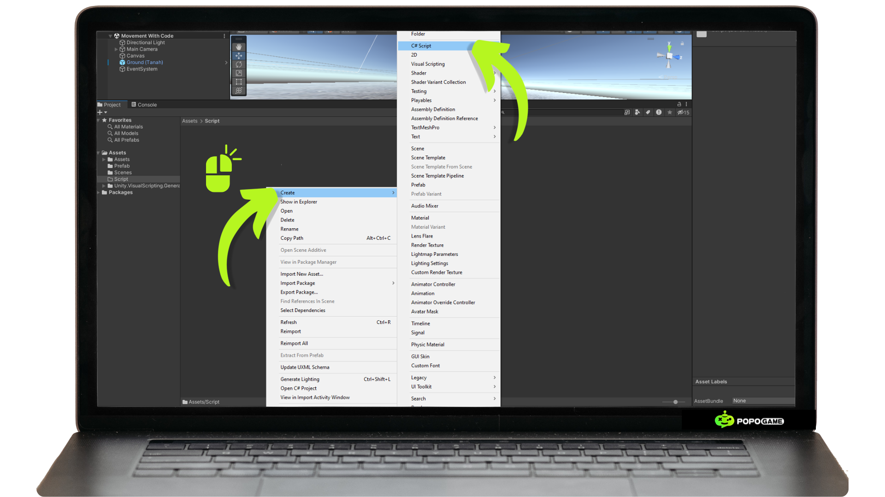
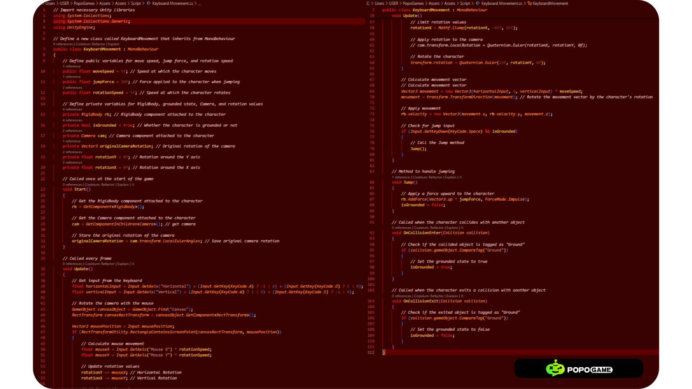
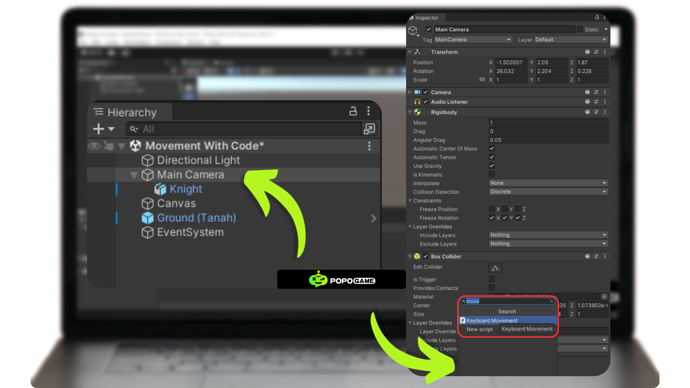

# How to create 3d player controls in unity for desktop platforms with C#

Next, we will create 3D character movement using scripting with the C# programming language. For this, we need a text editor to write and edit scripts outside of the Unity application. This script will control both the camera and character movement, allowing the character to move forward, right, left, backward, jump, and adjust the camera rotation. By using C#, we can create responsive and dynamic character controls, enhancing the overall gaming experience. This process will include script creation and configuration, movement logic implementation, and testing to ensure all features function properly.

## Preparing the Scene

Before we start implementing the character movement system into the project, we first need to build an environment that supports this process. One of the key aspects of creating this environment is providing a flat area for the character to move on.
To prevent the character from falling through the scene when added, the ground surface must be equipped with a Collider component. This component acts as a physical boundary, preventing the character from passing through or falling through objects that should serve as solid ground. With the Collider in place, Unity can detect collisions between the character and the surface, ensuring that the character remains on the ground while moving or performing actions such as jumping.
First, we will create a scene by right-clicking on the Project panel -> Create -> Scene. Once the scene is added to the project, name it according to your preference. Finally, open the scene by double-clicking on it.

After entering the scene, we will add a GameObject to it. Right-click on the Hierarchy panel -> then select the required GameObject. 

We will need various GameObjects to support our character's movement. Additionally, we must pay attention to the hierarchy levels of the GameObjects we create, as improper hierarchy structure may cause bugs or unexpected errors.
Below are the GameObjects required to implement the movement in this tutorial. Feel free to add additional GameObjects as needed.

Below is an explanation of the function of each gameobject added to the hierarchy:

**1. Directional Light**: In Unity, Directional Light is used to simulate a distant light source, like the sun. It even provides lighting across the entire scene and creates realistic directional shadows.

**2. Main Camera:** The Main Camera in Unity is the default camera used to display the game's perspective to the player.

**3. Knight:** This is a 3D gameobject, which you can replace with any 3D object you like. The knight is placed inside the main camera so that when the camera moves, the 3D knight object also moves. This object is a child of the Main Camera.

**4. Canvas:** Used to manage and display UI (user interface) elements. For cursor input to rotate the camera, the Canvas can detect cursor movements and clicks, which can then be used to control camera rotation in the game.

**5. Ground:** This serves as the terrain or road to prevent 3D objects with a rigidbody from falling down.

**6. Event System:** This component manages user input and interactions between UI elements. It enables the detection of events such as button clicks, screen touches, or mouse movements, and directs those events to the appropriate UI elements.

## Preparing the Necessary Components

We need to add components that will be used in the scene to support the movement of the character we will be controlling.

First, we will add a mesh collider to the Ground. You are free to use either a mesh collider or a box collider. To add a collider to a gameobject, first select the gameobject in the hierarchy. The inspector for the selected game object will appear. Next, click the "Add Component" button -> type "collider" in the search box -> then select the collider and adjust its settings as shown below.

Next, we will add the collider and rigidbody components to the camera. Why don't we put the rigidbody component on the character's gameobject? Because we want the character to use the rigidbody from the camera. To add the rigidbody and collider, first, select the Main Camera gameobject located in your Unity hierarchy. Then, the inspector will appear on the right. Click the "Add Component" button -> Type "Collider" and "Rigidbody" into the search box that appears -> Click on Collider and then Rigidbody to add both components to the Main Camera inspector -> Match the settings as shown below.

## Creating a Keyboard Movement Script

We have reached the final stage of developing simple movement using only one script. In this stage, we will determine the player's movement style. Here, you are free to choose the text editor you prefer to modify the script.
First, we need to create a script in the project file by right-clicking on the project file -> Create -> C# Script -> Double-click on the script you created and named.

After that, the chosen text editor will open. Next, we will dive into creating a simple movement script. Below is the content of the KeyboardMovement Script along with documentation for the functionality of each code block.

Next, we will insert the script we have created into the Main Camera component. First, click on the Main Camera gameobject, then the inspector information will appear on the right. Click the "Add Component" button -> Type the name of your movement script -> Click -> Fill in the required variables.

Then save and run the program by pressing the play button, the source code is available in Repository feel free to Access it :).

